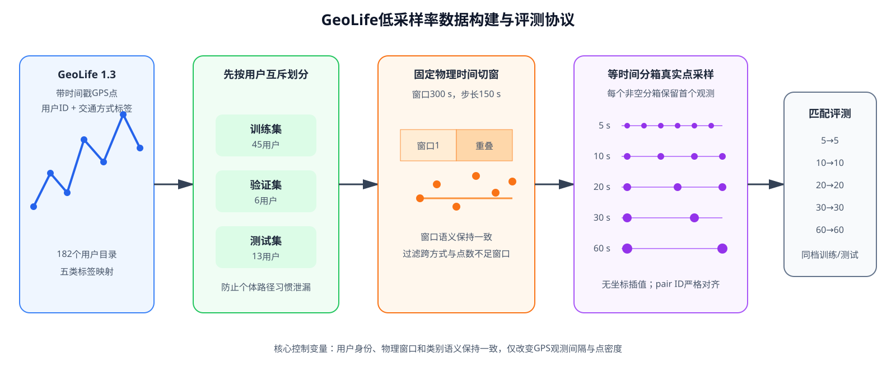
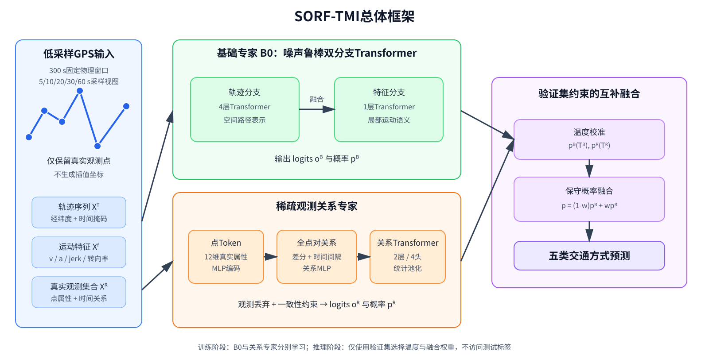
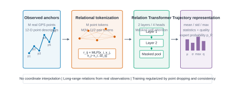
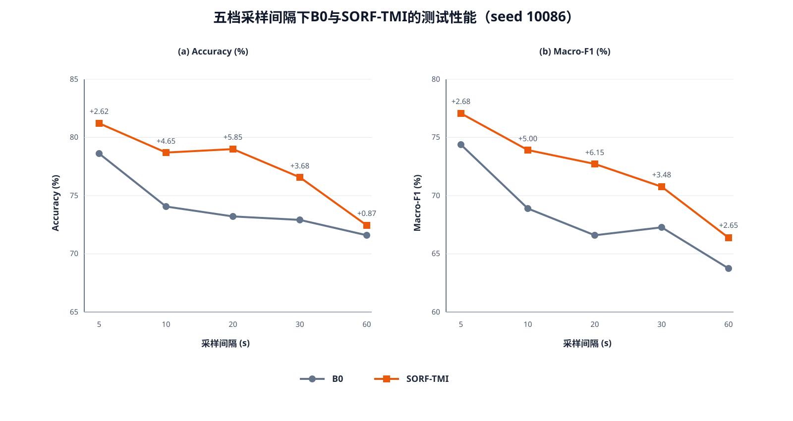
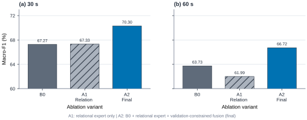

# 面向低采样率GPS轨迹的真实观测关系增强与互补融合交通方式识别

> **论文初稿 v0.5（最终组件同步稿，2026-08-31）**
> 英文暂定题目：*Travel Mode Identification from Low-Rate GPS Trajectories via Real-Observation Relational Encoding and Complementary Fusion*
> 方法暂定名称：SORF-TMI（Sparse-Observation Relational Fusion for Travel Mode Identification）
> 本稿已经按组件裁剪结论统一为“真实观测关系专家 + 验证集约束校准融合”的最终模型，并同步五档主实验、30/60秒三种子实验、消融实验、代表性方法对比、复杂度实验及矢量图。所有标有“【待补】”的内容均不得在对应事项完成前改写为确定结论。

## 投稿前待补清单（不进入论文正文）

- 【已完成】在相同用户划分、五档采样数据和评价脚本下完成Takahashi GPS-only RF、XGBoost、Dabiri CNN、DeepInsight-ViT和MASO-MSF公平对比。
- 【已完成】在相同RTX 5070和batch size下统计B0、关系专家与SORF-TMI的参数量、FLOPs、推理时间和峰值显存。
- 【待补-建议】根据最终投稿期刊或学校模板调整篇幅、图表编号、参考文献格式和中英文摘要。
- 【已完成】数据构造协议图、最终整体框架图、真实观测关系编码器图、五档主结果图和裁剪后消融结果图均已生成SVG矢量版本。
- 【待补-可选】在更多随机种子下做配对显著性检验；目前每个重点档位仅有3个种子，不使用“统计显著”措辞。
- 【待补-作者信息】作者、单位、基金、通信作者、致谢和数据伦理声明。

---

## 摘要

基于全球定位系统（Global Positioning System，GPS）轨迹的交通方式识别能够为居民出行调查、城市交通规划和移动服务提供低成本的数据支持。然而，移动设备为降低定位能耗而延长采样间隔后，固定时间窗口内的真实观测点数量显著减少，速度、加速度和方向变化等运动特征的估计也随之变得不稳定，导致传统识别模型性能下降。针对这一问题，本文提出一种面向低采样率GPS轨迹的真实观测关系增强与互补融合方法SORF-TMI。该方法保留原噪声鲁棒双分支Transformer作为基础模型，同时构建稀疏观测关系专家：首先从固定物理时间窗口中选择覆盖全程的真实GPS观测，不进行坐标插值；随后联合编码单点属性、任意两点之间的差分关系、相对时间间隔和轨迹级统计量，以补充低采样条件下局部序列信息的不足。关系专家使用清洁与含噪轨迹的监督分类目标学习稳定的关系表示；推理阶段仅利用验证集选择温度和融合权重，将关系专家与原双分支模型进行保守概率融合。

本文在Microsoft Research GeoLife 1.3公开数据集上构建5、10、20、30和60秒五档固定采样视图。所有视图采用等物理时间分箱并保留每个非空分箱中的第一个真实观测点，使用300秒窗口和150秒步长，并在生成窗口前实施用户互斥的训练、验证和测试划分。实验结果表明，SORF-TMI在五档采样间隔上均优于匹配训练的双分支基线，Accuracy和Macro-F1平均分别提高3.59和4.08个百分点。在论文重点关注的30秒条件下，三个随机种子的Accuracy由71.22%±1.60%提高至75.76%±0.53%，Macro-F1由66.02%±1.24%提高至70.09%±0.22%；在60秒条件下，两项指标分别由68.55%±3.50%和61.80%±2.38%提高至70.75%±2.62%和64.97%±2.34%。消融实验显示，关系专家不能稳定替代B0，而验证集约束的互补融合在30秒和60秒分别带来3.02/3.04和1.14/2.99个百分点的Accuracy/Macro-F1增益。组件裁剪进一步表明，删除观测丢弃与一致性训练后五档平均性能不降，因此最终模型仅保留有实验证据支持的关系编码和校准融合。上述结果说明，在不生成虚假插值坐标的前提下，显式建模稀疏真实观测之间的关系能够缓解低采样率造成的识别性能退化。

**关键词：** 交通方式识别；低采样率GPS；稀疏轨迹；关系编码；Transformer；多模型融合

## Abstract

GPS-based travel mode identification supports travel surveys, transportation planning, and context-aware mobility services. However, extending the positioning interval for energy-efficient sensing substantially reduces the number of real observations within a fixed physical-time window and destabilizes motion features such as velocity, acceleration, and heading change. This paper proposes SORF-TMI, a sparse-observation relational fusion framework for travel mode identification from low-rate GPS trajectories. SORF-TMI retains a noise-robust dual-branch Transformer as the base model and introduces a relational expert that explicitly models real observation points, pairwise differences, temporal gaps, and trajectory-level statistics without synthesizing interpolated coordinates. The relational expert is trained with supervised clean/noisy-view classification, while validation-calibrated probability fusion combines its complementary decisions with those of the base model. An additional observation-drop consistency component was evaluated and removed because it did not improve aggregate performance.

Five fixed-rate views with sampling intervals of 5, 10, 20, 30, and 60 seconds are constructed from the public GeoLife 1.3 dataset using equal-duration temporal episodes and the first real observation in each non-empty episode. User-disjoint training, validation, and test partitions are created before view generation. Across the five matched-rate experiments, SORF-TMI improves Accuracy and Macro-F1 by 3.59 and 4.08 percentage points on average, respectively. Over three random seeds, the method improves Accuracy/Macro-F1 from 71.22%/66.02% to 75.76%/70.09% at 30 seconds, and from 68.55%/61.80% to 70.75%/64.97% at 60 seconds. Ablation results show that the relational expert is complementary rather than a replacement for the base model, and that validation-constrained fusion is the main source of improvement. These findings demonstrate the value of explicitly modeling relations among sparse real observations for low-rate GPS travel mode identification.

**Keywords:** travel mode identification; low-rate GPS; sparse trajectory; relational encoding; Transformer; complementary fusion

---

## 1 引言

交通方式是描述居民移动行为的重要语义信息。准确识别步行、自行车、公交车、小汽车和轨道交通等出行方式，可服务于居民出行调查、交通需求估计、碳排放核算、公共交通规划及个性化移动服务。与依赖人工填写的传统出行日志相比，智能手机和便携式定位设备采集的GPS轨迹具有连续、客观和低人工负担等优势，因而成为自动交通方式识别的重要数据来源[1-3]。

GPS轨迹通常表示为带时间戳的经纬度点序列。已有研究通过速度、加速度、方向变化等人工运动特征，或利用卷积神经网络、循环神经网络和Transformer自动学习时空表示，实现了较高的识别精度[3,8,12]。然而，较高的GPS采样频率会增加设备能耗、存储和通信开销。在长时间、大规模或被动式移动感知场景中，定位系统往往采用较长的采样间隔，甚至出现空时间段。Zhou等[5]和DeepTravel[4]均从节能定位角度讨论了低频采样；Burkhard等[6]进一步指出，采样率和数据划分方式都会显著影响交通方式识别结果；Takahashi和Fujii[11]在GeoLife上研究了最高5分钟间隔的稀疏GPS分类，验证了速度和地理信息对稀疏轨迹识别的重要性。

低采样率带来的困难不只是“输入长度缩短”。首先，相邻点间隔变大后，短时加减速、启停和转向行为可能完全落在两个观测之间；其次，由离散点差分得到的速度、加速度和方向变化对个别定位误差更加敏感；再次，固定长度重采样或坐标插值虽然能满足神经网络输入要求，却可能生成原始设备未实际观测到的位置，从而引入额外假设。最后，如果同一用户的轨迹同时出现在训练集和测试集，模型可能学习个人路径习惯，使低采样率下的性能被高估[5,6]。

原始噪声鲁棒交通方式识别框架[12]采用轨迹—运动特征双分支Transformer，同时利用清洁轨迹和含噪轨迹进行训练，在真实噪声条件下具有较好的鲁棒性。但该模型主要针对定位噪声设计，并未显式描述固定物理时间窗口中少量真实观测点之间的长跨度关系。当采样间隔达到30秒或60秒时，一个300秒窗口中通常只剩约10个或5个有效点，仅依靠原有局部运动序列表示存在明显局限。

针对上述问题，本文在原双分支模型基础上提出SORF-TMI。其核心思想不是根据稀疏点重建一条看似稠密的轨迹，而是直接学习“已经观测到的真实点之间有什么关系”。具体而言，关系专家同时构建点级token和全点对关系token，将任意两个观测的特征、差分和归一化间隔输入Transformer，并结合均值、标准差、极值和观测密度形成稀疏轨迹表示。训练时利用清洁与含噪轨迹的监督目标学习关系表示；推理时通过验证集选择的温度与融合权重，将关系专家的长跨度运动信息与双分支模型的空间—运动表示结合。

本文的主要工作如下：

1. **建立可复现的低采样率评测协议。** 在GeoLife 1.3上先按用户划分训练、验证和测试集合，再以300秒物理窗口构建5、10、20、30和60秒五档严格配对采样视图。采样过程采用公开研究中的等时间分箱算子，仅保留真实GPS点，不进行坐标插值。
2. **提出真实观测关系增强方法。** 通过单点token、全点对关系token、长跨度差分、轨迹统计量和观测质量量化，直接学习极少真实GPS点之间的运动关系，避免将低采样问题简单转化为插值重建问题。
3. **设计验证集约束的校准融合策略。** 分别校准B0和关系专家的输出，并仅在验证集选择融合权重，防止单独性能不足的关系专家覆盖基础模型的可靠信息。
4. **开展五档、三种子、组件裁剪和公平对比实验。** 五档匹配训练结果均取得正向提升，30秒和60秒共6组随机种子实验方向一致；受控裁剪实验排除了缺少稳定增益的观测丢弃与一致性组件。在统一用户互斥五档协议下，最终SORF-TMI的五档平均Macro-F1高于五种重新训练的传统与深度学习代表方法。

## 2 相关工作

### 2.1 基于GPS轨迹的交通方式识别

早期GPS交通方式识别主要依赖轨迹分段、人工运动特征和传统分类器。Zheng等[1]提出基于变化点的轨迹分段方法，并比较决策树、贝叶斯网络、支持向量机和条件随机场，奠定了GeoLife交通方式识别的基本流程。此类方法通常统计速度、加速度、停留和方向变化，具有较强可解释性，但特征阈值容易受到道路环境、拥堵和定位误差影响。

深度学习方法减少了对人工阈值的依赖。Dabiri和Heaslip[3]将速度、加速度、jerk和bearing rate等GPS派生序列输入卷积神经网络；Pei等[8]通过多尺度卷积与混合注意力提取短期行为和长期趋势；Ma等[13]构建多阶段融合网络整合不同尺度的GPS表示。Ribeiro等[9]将轨迹特征转换为图像表示并使用视觉Transformer，以适应不同长度及不一致间隔的轨迹。上述方法表明，多尺度、注意力和表示融合有助于交通方式分类，但其原始结果基于不同类别、划分和采样条件，不能直接与本文数值比较。

### 2.2 低采样率与节能交通方式识别

低采样研究通常从设备续航和被动信令数据可用性出发。Zhou等[5]采用15秒周期的低频传感器特征与分层分类，以降低大规模应用能耗；Wang等[4]提出DeepTravel，利用低定位率传感器的少量特征识别四类交通方式。Burkhard等[6]系统分析空间精度、采样率、轨迹分段和分类器对识别性能的影响，并强调不恰当的数据划分会导致准确率失真。Takahashi和Fujii[11]在GeoLife上人工构造1、3和5分钟稀疏轨迹，比较采样频率、预处理、特征和分类算法，在5分钟条件下利用随机森林和GIS相关信息获得74.8% Accuracy与75.2% F1。

这些工作证明了从公开稠密轨迹构造可控稀疏视图的合理性，但也存在两点差异：一是部分方法依赖加速度、Wi-Fi或GIS等额外信息[5,10,11]，与GPS-only条件不完全公平；二是许多实验未同时保持用户互斥、固定物理窗口和跨采样档严格配对。本文不将外部数据引入主模型，而是在统一的GPS-only协议下研究不同固定采样间隔。

### 2.3 多源融合、噪声鲁棒与本文定位

Siargkas等[10]利用两个子网络分别编码低频加速度和位置数据，再通过共享嵌入空间和注意力多实例学习进行融合，说明异构信息之间具有明显互补性。Lu等[12]则针对真实定位噪声，提出清洁—含噪混合数据、行为指示掩码和轨迹—特征双分支Transformer。该双分支模型能够结合空间路径与运动语义，是本文基础模型的来源。

本文与上述工作的区别在于：研究对象是GPS-only低采样轨迹，而不是多传感器异构融合；目标是缓解真实观测点减少造成的信息退化，而不是仅处理坐标噪声；方法不生成插值坐标，而是显式建模少量真实点之间的全点对关系；评测采用同档训练、同档测试，回答模型在不同固定低采样条件下的识别能力，不声称对未见采样率进行零样本泛化。

### 2.4 现有研究空缺与方法选择

综合已有工作，低采样率交通方式识别大致存在三类技术路径。第一类依靠额外传感器或外部地理信息弥补GPS不足，例如加速度计、Wi-Fi、道路网络和POI。该路径能够增加信息量，但部署条件、隐私成本和数据可获得性也随之增加。第二类利用插值、补点或固定长度重采样恢复规则序列，其优点是可直接复用常规时序模型，但重建结果依赖运动假设，且难以区分“真实观测信息”和“重建先验”各自的贡献。第三类直接对稀疏GPS点提取速度、距离和统计特征，解释性较强，但传统统计分类器对复杂类别边界的表达能力有限。

本文选择第四种折中路线：不要求额外传感器，不恢复不存在的坐标，而是在真实点集合上学习长跨度关系，并保留成熟双分支模型提供的空间路径和局部运动语义。这一选择对应两个具体研究问题：其一，当固定窗口只有5–11个点时，显式点对关系能否提供局部相邻特征之外的信息；其二，关系表示能否作为互补专家稳定增强已有模型，而不是完全替代已有表示。后续实验和消融均围绕这两个问题展开。

## 3 问题定义与数据协议

### 3.1 任务定义

设一个仅包含单一交通方式的GPS轨迹窗口为

$$
\mathcal{T}=\{(t_i,\phi_i,\lambda_i)\}_{i=1}^{n},
$$

其中$t_i$为时间戳，$\phi_i$和$\lambda_i$分别表示纬度和经度。交通方式标签为$y\in\mathcal{Y}$，本文类别集合为

$$
\mathcal{Y}=\{\text{Walk},\text{Bike},\text{Bus},\text{Car},\text{Train}\}.
$$

给定目标采样间隔$\Delta\in\{5,10,20,30,60\}$秒，采样算子$S_{\Delta}$将300秒窗口划分为长度为$\Delta$的时间分箱，并保留每个非空分箱中的第一个真实GPS点：

$$
\mathcal{T}^{(\Delta)}=S_{\Delta}(\mathcal{T}).
$$

空分箱保持为空，不插入坐标。目标是学习分类函数$f_{\Delta}$，将该档采样轨迹映射为类别概率：

$$
\hat{\mathbf{p}}=f_{\Delta}(\mathcal{T}^{(\Delta)}),\qquad
\hat{y}=\arg\max_c \hat{p}_c.
$$

本文采用“同档训练—同档验证—同档测试”：每个$\Delta$独立训练B0和关系专家，并在相同采样档测试。这样能够控制输入信息量，避免把跨采样域偏移与模型本身的识别能力混为一谈。

### 3.2 用户互斥划分

GeoLife包含182个用户目录，其中本文使用具有有效交通方式标签且满足五类映射的数据。为了避免同一用户的路径、活动范围和出行习惯同时出现在训练集和测试集，本文在窗口生成之前按用户进行划分，随机种子为42。轨迹级源数据的划分情况如表1所示。

**表1 用户互斥源数据划分**

| 划分 | 用户数 | 标签轨迹数 | Walk | Bike | Bus | Car | Train |
|---|---:|---:|---:|---:|---:|---:|---:|
| Train | 45 | 7,388 | 3,075 | 1,217 | 1,438 | 983 | 675 |
| Validation | 6 | 1,225 | 522 | 206 | 263 | 187 | 47 |
| Test | 13 | 948 | 434 | 148 | 165 | 137 | 64 |

经过300秒窗口和最少5点过滤后，有效窗口用户数为44/6/12，三个集合仍严格互斥。窗口级样本数分别为49,093、7,505和4,941。

### 3.3 五档物理时间采样

本文采用Burkhard等[6]使用的等物理时间episode思想：将窗口切分为等长时间区间，每个非空区间保留第一个实际观测。所有低采样视图均从同一个5秒规范视图确定性生成，并共享标签、用户ID、源轨迹ID和窗口pair ID。该设计具有三点优势：其一，不合成设备没有观测到的经纬度；其二，五档视图在窗口语义上严格配对；其三，能够明确控制目标采样间隔并复现实验。

**图1 GeoLife低采样率数据构建与评测协议。** 用户划分先于窗口和采样视图生成，五档数据共享物理窗口与语义，只改变真实GPS观测密度；每档采用独立的同档训练和测试。

300秒窗口的步长为150秒，最少保留5个点。表2给出测试窗口中的采样统计。实际平均间隔可能略高于目标值，因为空时间分箱不进行插值。

**表2 五档采样视图统计（测试窗口）**

| 目标间隔 | 平均点数 | 中位点数 | 点数范围 | 平均实际间隔/s | 中位实际间隔/s |
|---:|---:|---:|---:|---:|---:|
| 5 s | 51.49 | 60 | 5–61 | 5.78 | 5 |
| 10 s | 26.81 | 30 | 5–31 | 11.24 | 10 |
| 20 s | 14.27 | 15 | 5–16 | 21.57 | 20 |
| 30 s | 9.94 | 10 | 5–11 | 31.56 | 30 |
| 60 s | 5.42 | 5 | 5–6 | 60.98 | 60 |

数据验证确认：训练、验证和测试用户无交集；五档元数据对齐；稀疏视图可由5秒视图重新执行采样算子得到；所有坐标均为真实点；平均点密度随采样间隔严格下降；每档均包含五个类别。运动特征计算后，少量片段因有效运动点不足被过滤，因此最终测试样本数为4,918–4,941，差异小于0.5%。

需要强调的是，目标采样间隔并不意味着相邻保留点的实际时间差始终精确等于目标值。若某个时间分箱中没有原始GPS点，该分箱不会被人工补齐，因此跨越空分箱的实际间隔会更长。这种处理保留了公开轨迹中真实存在的不规则性，也使本文任务比理想等间隔序列更接近被动采集场景。表2同时报告目标间隔和实际间隔，避免将二者混为一谈。

### 3.4 轨迹与运动特征

基础双分支模型使用两类输入：轨迹分支输入纬度和经度序列；特征分支使用速度、加速度、jerk和方向变化率。完整预处理还计算时间间隔、小时、距离、航向及航向变化等属性。关系专家选取距离、速度、加速度、jerk、航向变化和航向变化率六个通道，并加入相对平面坐标$(x_i,y_i)$、单步位移$(\Delta x_i,\Delta y_i)$以及航向角的正余弦，共形成12维点描述。连续值采用带符号对数变换并根据训练集统计量标准化。

其中，相对平面坐标由窗口首个有效点作为局部原点，用于减少绝对城市位置对分类的直接影响；航向角采用正余弦形式，是为了避免$0^\circ$与$360^\circ$在数值上不连续。训练集统计量只从训练用户计算，再固定应用于验证和测试集合，防止测试分布信息进入标准化过程。对于分母为零、时间戳重复或差分不可用的情况，预处理使用掩码排除无效运动量，而不是将其误当作正常零速度。

### 3.5 协议可信性与研究边界

公开数据集并不等于“所有实验设置都由官方直接提供”。GeoLife官方提供原始GPS轨迹、匿名用户编号和部分交通方式标签；五档采样视图、300秒窗口、用户互斥划分及类别映射属于本文可复现的数据协议。换言之，原始数据来源是官方公开数据，低采样任务则按照公开文献中常用的可控降采样思想构造。本文通过保留原始点索引、窗口pair ID、用户ID、构造脚本、统计清单和SHA-256校验值，使人工构造过程可审计，而不把派生数据误称为新的官方数据集。

同档训练—同档测试用于回答“在给定低采样采集条件下，模型能够达到怎样的识别性能”。它与“只在5秒训练、直接测试未知60秒数据”的跨域泛化任务不同，也与“一个混合模型同时处理任意采样率”的统一模型任务不同。本文暂不扩张结论边界，保证模型改进和数据稀疏程度之间的因果解释尽可能清晰。

## 4 SORF-TMI方法

### 4.1 总体框架

SORF-TMI由原始双分支基础模型B0、稀疏观测关系专家和验证集约束的概率融合器组成。B0读取完整的同档轨迹—特征序列，擅长提取空间位置与局部运动语义；关系专家最多选择覆盖300秒窗口的16个均匀真实观测点，其中30秒档最多11点、60秒档最多6点，并显式构造任意两个有效点之间的关系。两个模型分别输出类别概率，最终利用验证集确定的温度和融合权重进行组合。

**图2 SORF-TMI总体框架。** B0保留原始双分支结构，关系专家只处理真实观测及其全点对关系；两个专家独立训练，推理阶段通过验证集温度校准和保守概率融合得到五类预测。

### 4.2 双分支基础模型

B0继承Lu等[12]的轨迹—运动特征双分支Transformer。轨迹分支将二维坐标投影至64维，使用4层、8头Transformer和固定位置编码；运动特征分支将4维运动特征投影至128维，使用1层、16头Transformer和可学习位置编码。两个分支分别编码后进行池化和特征融合，再经分类头输出五类logits：

$$
\mathbf{o}^{B}=g_B\left(E_T(\mathbf{X}^{T}),E_F(\mathbf{X}^{F})\right).
$$

每个采样档独立训练一个B0，并保存验证集最优checkpoint。SORF-TMI不修改B0内部结构，而是将其作为提供稳定空间—运动信息的互补基础模型。

### 4.3 真实观测点选择与点表示

对于包含$n$个有效点的窗口，关系专家最多使用

$$
M_{\Delta}=\min\left(16,\left\lceil\frac{300}{\Delta}\right\rceil+1\right)
$$

个锚点。当$n\le M_{\Delta}$时保留全部点；否则在真实点索引上均匀选择$M_{\Delta}$个点，确保覆盖窗口起点至终点。该步骤只选择原始观测，不改变B0输入，也不生成插值点。

设第$i$个选中点的12维描述为$\mathbf{x}_i$，点token定义为

$$
\mathbf{h}^{p}_i=\operatorname{MLP}_{p}(\mathbf{x}_i)+\mathbf{e}_{p},
$$

其中$\mathbf{e}_{p}$为可学习点类型嵌入。

### 4.4 全点对关系编码

低采样窗口中的相邻关系数量有限，但非相邻真实点仍包含总位移、长时间加减速趋势和路径变化信息。因此，本文对所有$i<j$构造关系token。归一化索引间隔为

$$
g_{ij}=\frac{j-i}{M_{\Delta}-1},
$$

关系输入及编码为

$$
\mathbf{q}_{ij}=[\mathbf{x}_i;\mathbf{x}_j;\mathbf{x}_j-\mathbf{x}_i;g_{ij}],
$$

$$
\mathbf{h}^{r}_{ij}=\operatorname{MLP}_{r}(\mathbf{q}_{ij})+\mathbf{e}_{r}.
$$

点token与关系token拼接后送入2层、宽度96、4头的Transformer编码器：

$$
\mathbf{H}=E_R\left([\mathbf{H}^{p};\mathbf{H}^{r}],\mathbf{m}\right),
$$

其中$\mathbf{m}$同时屏蔽填充点以及包含无效端点的关系。相较只使用相邻差分，全点对关系能够在仅有5–11个点时直接表达跨越多个采样间隔的运动变化。

**图3 真实观测关系编码器。** 以60秒档最多6个锚点为例，模型构造6个点token和最多15个全点对关系token，通过mask排除填充与无效关系，再经关系Transformer和统计池化输出专家概率。

### 4.5 轨迹级统计与质量描述

Transformer输出分别计算有效token的均值、标准差和最大值。原始12维点描述同时计算均值、标准差、最小值和最大值。进一步构造点密度和有效关系密度：

$$
q_p=\frac{\sum_i m_i}{M_{\Delta}},\qquad
q_r=\frac{\sum_{i<j}m_i m_j}{\binom{M_{\Delta}}{2}}.
$$

最终池化表示为

$$
\mathbf{z}=\operatorname{MLP}_{z}([\mu(\mathbf{H});\sigma(\mathbf{H});
\max(\mathbf{H});\mu(\mathbf{X});\sigma(\mathbf{X});
\min(\mathbf{X});\max(\mathbf{X});q_p;q_r]),
$$

关系专家输出$\mathbf{o}^{R}=\mathbf{W}_c\mathbf{z}+\mathbf{b}_c$。统计量使模型在序列极短时仍能利用整体运动范围，质量描述则明确告知模型当前窗口的实际观测充分程度。

### 4.6 验证集约束的互补概率融合

B0和关系专家的logits分别在验证集上选择温度$\tau_B$和$\tau_R$，得到校准概率$\mathbf{p}^{B}$和$\mathbf{p}^{R}$。融合概率为

$$
\mathbf{p}^{F}=(1-w)\mathbf{p}^{B}+w\mathbf{p}^{R},\qquad w\in[0,0.7].
$$

权重以0.01为步长，仅在验证集搜索。选择准则优先最大化Accuracy和Macro-F1中较小的相对增益，再考虑总增益、Macro-F1和Accuracy；测试集不参与温度、权重或checkpoint选择。该保守策略允许关系专家提供互补信息，同时避免其在极稀疏条件下单独性能不足时完全替代B0。

### 4.7 方法机制与计算规模

B0与关系专家具有不同的归纳偏置。B0按原序列顺序建模，擅长利用连续空间位置、相邻运动量和行为掩码；关系专家将任意真实点对都看作候选长跨度证据，因此不要求辨别信息必须出现在相邻点之间。当轨迹稀疏后，相邻点本身已经跨越较长时间，此时仅堆叠局部卷积或增加序列层数未必能够恢复被遗漏的中间行为，而点对关系可以直接描述窗口首尾、早期—中期和中期—末期的总体运动变化。

若有效锚点数为$M$，点token数为$M$，关系token数为$M(M-1)/2$，总token数为

$$
L_R=M+\frac{M(M-1)}{2}=\frac{M(M+1)}{2}.
$$

在本文约束下，30秒档$M\leq 11$，因此$L_R\leq66$；60秒档$M\leq6$，因此$L_R\leq21$。关系Transformer的自注意力复杂度为$O(L_R^2d)$，虽然点对构造是二次的，但低采样条件下$M$很小，计算规模仍然受控。5秒和10秒档最多截取16个覆盖全程的锚点，以防关系token随原始点数无限增长。锚点上限既控制计算开销，也使关系专家更侧重全程结构，而不是重复B0对密集局部序列的建模。

## 5 实验设置

### 5.1 数据集与类别

GeoLife 1.3由Microsoft Research Asia公开，包含182名用户在2007年至2012年间采集的GPS轨迹[2]。原始归档包含18,670个PLT文件，主要采样间隔为1–5秒。本文保留Walk、Bike、Bus、Car/Taxi和Subway/Train五个类别，并将Car与Taxi合并、Subway与Train合并，其余类别不进入本实验。

### 5.2 模型输入规模

**表3 五档特征处理后的模型样本数**

| 采样间隔 | Train | Validation | Test |
|---:|---:|---:|---:|
| 5 s | 61,142 | 7,043 | 4,932 |
| 10 s | 63,618 | 7,212 | 4,941 |
| 20 s | 64,055 | 7,259 | 4,940 |
| 30 s | 63,857 | 7,236 | 4,940 |
| 60 s | 62,786 | 7,129 | 4,918 |

训练数据经过原框架的类别增强与轨迹特征分段，因此训练片段数可能高于窗口数；验证和测试不做训练增强。五档测试样本的少量差异来自特征有效性过滤，不改变用户互斥关系。

### 5.3 训练配置

B0采用RAdam优化器，初始学习率$10^{-3}$，batch size为64，最多训练200轮，early-stopping patience为40。输入采用50%清洁/含噪混合策略。关系专家使用AdamW，初始学习率$3\times10^{-4}$，权重衰减$2\times10^{-4}$，batch size为256，最多70轮，patience为12；学习率使用余弦退火，最低为初始值的5%，梯度范数裁剪为2.0。最终模型以清洁视图和含噪视图监督交叉熵的均值作为训练目标，不使用观测丢弃或一致性损失。关系专家以验证集Accuracy与Macro-F1的平衡排名保存最佳状态。

五档主实验使用随机种子10086；30秒和60秒进一步使用42、2024和10086三个种子。所有实验在NVIDIA GeForce RTX 5070 GPU、Python 3.10.20、PyTorch 2.7.1+cu128环境中完成。

### 5.4 评价指标

本文使用Accuracy和Macro-F1作为主要指标。设测试样本数为$N$，Accuracy为

$$
\operatorname{Accuracy}=\frac{1}{N}\sum_{i=1}^{N}\mathbb{I}(\hat{y}_i=y_i).
$$

对类别$c$，Precision、Recall和F1分别为

$$
P_c=\frac{TP_c}{TP_c+FP_c},\quad
R_c=\frac{TP_c}{TP_c+FN_c},\quad
F1_c=\frac{2P_cR_c}{P_c+R_c}.
$$

Macro-F1为五类F1的算术平均：

$$
\operatorname{MacroF1}=\frac{1}{5}\sum_{c=1}^{5}F1_c.
$$

由于测试集类别不均衡，Macro-F1比单独Accuracy更能反映Bus和Train等少数类别的识别质量。

### 5.5 对比方法

直接基线B0为原噪声鲁棒轨迹—运动特征双分支Transformer[12]。为避免不同论文的数据划分、类别和采样设置造成不公平比较，所有外部方法均在本文用户互斥五档协议上重新训练，且通过同一个评价入口计算Accuracy和Macro-F1。

**表4 代表性方法及公平适配说明**

| 方法 | 类型 | 输入 | 公平适配状态 |
|---|---|---|---|
| Takahashi GPS-only RF[11] | 稀疏GPS随机森林 | 速度等GPS统计量 | 已完成；排除GIS/POI特征 |
| XGBoost | 梯度提升树 | 与RF相同的GPS统计量 | 已完成 |
| Dabiri CNN[3] | 一维卷积网络 | 速度/加速度/jerk/方向变化率 | 已完成 |
| DeepInsight-ViT[9] | 特征图像与视觉Transformer | GPS运动特征图像 | 已完成结构适配 |
| MASO-MSF[13] | 多尺度深度融合 | GPS多通道时序表示 | 已完成结构适配 |
| B0[12] | 双分支Transformer | 坐标+运动特征 | 已完成 |
| SORF-TMI | 本文方法 | B0+真实观测关系 | 已完成 |

Takahashi方法原文包含GIS相关特征，本文为保持GPS-only边界只复现其运动统计特征随机森林。DeepInsight-ViT和MASO-MSF原始数据产品、类别设置与随机划分不兼容本文协议，因此表4和后续结果明确标注为“结构适配”，不将其宣称为原论文端到端流程的精确复现。

### 5.6 公平性控制与复现实验原则

所有B0与SORF-TMI比较共享同一档训练、验证和测试文件，同一seed下使用相同的数据索引和类别定义。B0 checkpoint仅由B0验证集结果选择；关系专家checkpoint、温度和融合权重仅由关系专家训练集与验证集决定。测试集只执行一次最终评估，不参与超参数搜索。外部方法后续复现时也必须使用相同用户列表、窗口pair ID、目标采样间隔和评价脚本。

为了区分单次训练波动与稳定趋势，本文先在五档上使用统一种子10086检查方法覆盖范围，再在研究重点30秒和60秒上补充42和2024两个种子。该设计不是用多次运行挑选最好结果：表6和表7逐个报告全部预定种子，并同时给出均值与样本标准差。由于种子数有限，重复实验用于验证提升方向及方差变化，而不替代正式的大样本显著性检验。

## 6 实验结果与分析

### 6.1 五档采样主结果

表5比较同一采样档独立训练和测试的B0与SORF-TMI。所有数值均为测试集百分比，提升表示SORF-TMI减去B0的绝对百分点。

**表5 五档匹配训练与测试结果（seed=10086）**

| 采样间隔 | B0 Acc. | SORF-TMI Acc. | ΔAcc. | B0 Macro-F1 | SORF-TMI Macro-F1 | ΔF1 |
|---:|---:|---:|---:|---:|---:|---:|
| 5 s | 78.61 | **81.79** | **+3.18** | 74.36 | **77.54** | **+3.18** |
| 10 s | 74.03 | **79.84** | **+5.81** | 68.92 | **74.72** | **+5.80** |
| 20 s | 73.16 | **77.94** | **+4.78** | 66.56 | **71.94** | **+5.39** |
| 30 s | 72.89 | **75.91** | **+3.02** | 67.27 | **70.30** | **+3.04** |
| 60 s | 71.55 | **72.69** | **+1.14** | 63.73 | **66.72** | **+2.99** |
| 五档平均 | 74.05 | **77.63** | **+3.59** | 68.17 | **72.25** | **+4.08** |

从B0结果看，采样间隔由5秒增至60秒时，Accuracy由78.61%下降至71.55%，Macro-F1由74.36%下降至63.73%，表明低采样率对类别均衡性能的影响更明显。最终SORF-TMI在五档上全部取得正向增益。其中10秒和20秒增益较大；60秒窗口通常只有约6个真实观测点，无法恢复未被采集的信息，但Macro-F1仍提高2.99个百分点，说明关系证据主要改善类别均衡表现。本文据此声称方法在低采样条件下稳定有效，而不声称增益随采样间隔单调增加。

### 6.2 低采样率多随机种子结果

**表6 30秒三随机种子结果**

| Seed | B0 Acc. | SORF-TMI Acc. | ΔAcc. | B0 Macro-F1 | SORF-TMI Macro-F1 | ΔF1 |
|---:|---:|---:|---:|---:|---:|---:|
| 42 | 71.07 | **75.16** | **+4.09** | 66.00 | **69.86** | **+3.86** |
| 2024 | 69.70 | **76.19** | **+6.50** | 64.79 | **70.10** | **+5.31** |
| 10086 | 72.89 | **75.91** | **+3.02** | 67.27 | **70.30** | **+3.04** |
| 均值±标准差 | 71.22±1.60 | **75.76±0.53** | **+4.53±1.78** | 66.02±1.24 | **70.09±0.22** | **+4.07±1.15** |

**表7 60秒三随机种子结果**

| Seed | B0 Acc. | SORF-TMI Acc. | ΔAcc. | B0 Macro-F1 | SORF-TMI Macro-F1 | ΔF1 |
|---:|---:|---:|---:|---:|---:|---:|
| 42 | 64.70 | **67.77** | **+3.07** | 59.14 | **62.31** | **+3.17** |
| 2024 | 69.40 | **71.80** | **+2.40** | 62.54 | **65.87** | **+3.33** |
| 10086 | 71.55 | **72.69** | **+1.14** | 63.73 | **66.72** | **+2.99** |
| 均值±标准差 | 68.55±3.50 | **70.75±2.62** | **+2.20±0.98** | 61.80±2.38 | **64.97±2.34** | **+3.16±0.17** |

30秒和60秒共6组实验均同时提高Accuracy与Macro-F1。30秒平均Accuracy和Macro-F1分别提高4.53和4.07个百分点；60秒分别提高2.20和3.16个百分点。60秒Macro-F1提升的跨种子波动较小，但最终模型本身仍存在较大的种子方差。由于每档仅有3个种子，本文将其表述为“方向一致的重复实验”，不使用严格统计显著性结论。

**图4 五档采样间隔下B0与SORF-TMI的测试结果。** 标注值为SORF-TMI相对B0的绝对百分点提升。B0的Macro-F1随采样间隔整体下降，而SORF-TMI在五档均保持正增益。

图4进一步说明，采样间隔与识别性能并非严格线性关系。例如B0在20秒和30秒的Accuracy接近，而Macro-F1在30秒略高于20秒，这与各档特征有效性过滤后样本构成、类别分布和训练随机性共同相关。因此，本文不把五个离散点拟合成确定的“采样率—性能函数”，而将其用于验证总体退化趋势和方法在不同稀疏程度下的适用范围。

### 6.3 类别级结果

**表8 seed10086下30秒和60秒各类别F1**

| 采样间隔 | 模型 | Walk | Bike | Bus | Car | Train |
|---:|---|---:|---:|---:|---:|---:|
| 30 s | B0 | 86.37 | 75.17 | 55.45 | 74.56 | 44.77 |
| 30 s | SORF-TMI | **87.28** | **76.25** | **59.27** | **78.52** | **50.21** |
| 60 s | B0 | 84.74 | 67.44 | **52.28** | 74.66 | 39.55 |
| 60 s | SORF-TMI | **85.81** | **67.94** | 51.86 | **75.66** | **52.33** |

30秒条件下五个类别F1均提高，其中Train、Car和Bus提升更明显。60秒条件下Walk、Bike、Car和Train提高，Bus轻微下降0.42个百分点；Train F1由39.55%提高至52.33%，是Macro-F1提升的主要来源。这说明关系专家并非使每个类别都单调改善，而是在极稀疏条件下对最困难类别提供了更明显的互补证据。类别级结果也说明必须同时报告Accuracy和Macro-F1：总体Accuracy容易被大类样本数量主导，而Macro-F1能够显示少数类别的改善与权衡。

### 6.4 最终组件消融与裁剪

消融实验使用seed10086，在30秒和60秒两个重点档位分别评估B0、独立关系专家和最终互补融合模型。A1只使用关系专家，A2在验证集完成温度校准与权重选择后融合B0和关系专家，也是本文最终SORF-TMI。

**表9 最终模型组件消融结果**

| 变体 | B0 | 关系编码 | 校准融合 | 30s Acc. | 30s F1 | 60s Acc. | 60s F1 |
|---|:---:|:---:|:---:|---:|---:|---:|---:|
| B0 | ✓ | — | — | 72.89 | 67.27 | 71.55 | 63.73 |
| A1 关系专家 | — | ✓ | — | 72.55 | 67.33 | 67.75 | 61.99 |
| A2 SORF-TMI（最终） | ✓ | ✓ | ✓ | **75.91** | **70.30** | **72.69** | **66.72** |

A1在30秒与B0接近、在60秒低于B0，说明关系专家不是一个可以独立替代基础模型的更强分类器。A2在30秒提升3.02/3.04个百分点，在60秒提升1.14/2.99个百分点，证明增益来自B0空间—局部运动证据与关系专家长跨度证据的互补。受控组件裁剪还比较了带观测丢弃/一致性训练的历史完整模型与A2：删除该训练组件后，五档平均Accuracy和Macro-F1分别变化+0.05和+0.09个百分点，30/60秒三种子均值变化均不超过0.22个百分点。因此该组件没有进入最终方法，也不再作为创新点。

**图5 最终组件消融结果。** 关系专家单独使用并不稳定；验证集约束的互补融合是两档低采样率性能提升的主要来源。

### 6.5 增益来源与失败情形分析

主结果和消融结果共同支持两个判断。第一，性能提升不能简单归因于“增加了一个更强分类器”。关系专家在60秒单独使用低于B0，但融合后超过二者，说明增益来自错误互补：B0在空间路径或局部运动证据可靠时提供稳定判断，关系专家在长跨度关系更有辨识度时修正部分样本。第二，低采样率存在不可恢复的信息下限。60秒窗口通常仅有约6个真实点，关系专家可以重新组织现有证据，却不能恢复设备从未采集的启停与转向细节，因此60秒Accuracy提升小于部分较密采样档位。本文据此将结论限定为“缓解低采样退化”，而不声称性能增益随采样间隔单调增加。

从类别表现看，最终模型对Train的帮助最明显，但60秒Bus略有下降。这表明全点对长跨度关系更适合捕捉轨道交通的整体方向和位移模式，却不能完全解决道路上的Bus与Car混淆。关系专家在极稀疏窗口也可能受单个异常定位点影响，因此最终方法保留B0并将融合权重限制在$[0,0.7]$，且所有参数只由验证集选择。

### 6.6 与代表性方法的比较

表10给出统一协议下重新训练和测试的结果。所有方法共享44/6/12名训练、验证和测试用户，共享五档数据、类别定义和测试评价函数；表中数值均为本实验重新计算，而非复制原论文在不同数据集或划分下的报告值。协议清单的SHA-256为`04cd4e719c34a035c79e4eabeca9d28301908e3f32dbab30ef269c268048a1ac`。

**表10 统一用户互斥五档协议下的代表性方法对比（seed=10086，Accuracy/Macro-F1，%）**

| 方法 | 5s Acc./F1 | 10s Acc./F1 | 20s Acc./F1 | 30s Acc./F1 | 60s Acc./F1 | 五档平均F1 |
|---|---:|---:|---:|---:|---:|---:|
| Takahashi GPS-only RF[11] | 78.81/74.38 | 77.60/72.61 | 75.26/70.29 | 74.37/69.43 | 68.93/64.42 | 70.23 |
| XGBoost | 79.64/75.35 | 77.86/73.52 | 75.97/71.70 | 75.79/70.94 | 69.60/64.88 | 71.28 |
| Dabiri CNN[3] | 78.18/73.72 | 76.93/72.75 | 76.46/71.14 | 72.04/66.50 | 67.89/62.51 | 69.32 |
| DeepInsight-ViT[9]（适配） | 75.26/71.10 | 76.30/71.26 | 74.37/69.47 | 68.81/63.98 | 69.36/64.30 | 68.02 |
| MASO-MSF[13]（适配） | 76.78/72.08 | 77.39/73.56 | 74.62/70.17 | 74.27/67.90 | 68.71/63.20 | 69.38 |
| B0 | 78.61/74.36 | 74.03/68.92 | 73.16/66.56 | 72.89/67.27 | 71.55/63.73 | 68.17 |
| SORF-TMI | **81.79/77.54** | **79.84/74.72** | **77.94/71.94** | **75.91/70.30** | **72.69/66.72** | **72.25** |

SORF-TMI在五个采样档的Accuracy均取得表中最高值，Macro-F1在5、10、20和60秒四档最高；30秒Macro-F1比XGBoost低0.64个百分点。五档平均Macro-F1为72.25%，比最强外部对比XGBoost的71.28%提高0.97个百分点。30秒和60秒两个重点低采样档，SORF-TMI相对XGBoost的Accuracy分别提高0.12和3.09个百分点，Macro-F1分别下降0.64和提高1.84个百分点。该结果支持最终模型在极稀疏60秒条件下具有更明显优势，但30秒与XGBoost基本相当，因此不应表述为对每个外部方法、每项指标都有大幅领先。

传统统计方法在本协议下表现较强：XGBoost的五档平均Macro-F1超过Dabiri CNN、DeepInsight-ViT适配模型和MASO-MSF适配模型。这说明低采样GPS的样本规模和统计运动特征仍适合树模型，也说明“使用更复杂网络”本身不能保证收益。SORF-TMI的优势来自B0空间—运动表示与真实观测关系专家的互补，而不是单纯增加网络深度。

### 6.7 模型复杂度与效率

表11使用60秒测试张量，在NVIDIA GeForce RTX 5070、PyTorch 2.7.1+cu128环境下测量。FLOPs由PyTorch `FlopCounterMode`对batch=1前向传播统计；延迟和峰值显存使用batch=64，输入预先驻留GPU，先预热40次，再执行5轮、每轮120次计时。表中推理时间为batch延迟除以64所得的单样本均摊延迟，不包含磁盘读取及CPU到GPU的数据传输。

**表11 60秒档模型复杂度与推理效率**

| 模型 | 参数量 | GFLOPs/样本 | 推理时间/ms | 峰值显存/MiB |
|---|---:|---:|---:|---:|
| B0 | 540,937 | 0.0060 | 0.0291 | 12.7 |
| 关系专家 | 331,497 | 0.0007 | 0.0160 | 15.1 |
| SORF-TMI整体 | 872,434 | 0.0066 | 0.0446 | 17.2 |

SORF-TMI的参数量是两个专家之和，相比B0增加61.3%；60秒前向FLOPs增加约10.0%，均摊推理延迟由0.0291 ms增至0.0446 ms，峰值显存由12.7 MiB增至17.2 MiB。完整模型需要依次运行B0和关系专家，因而不会比B0单独推理更快；本文的效率目标是以有限额外开销换取低采样识别性能，而不是同时降低计算量。

30秒档最多使用11个真实锚点，产生55个点对关系token；60秒档最多使用6个锚点，只产生15个点对token。因此关系专家的FLOPs由30秒的0.0017 GFLOPs降至60秒的0.0007 GFLOPs，完整模型峰值显存也由31.8 MiB降至17.2 MiB。该实测结果与关系token数量随观测点数二次变化的复杂度分析一致。

## 7 讨论

### 7.1 为什么使用噪声鲁棒双分支模型作为基础模型

低采样率与定位噪声是两个不同但相关的问题。采样间隔增大减少了真实观测数量，同时使通过相邻点差分得到的速度、加速度和方向变化对定位误差更加敏感。因此，一个同时利用轨迹坐标和运动特征、并对清洁/含噪输入进行联合建模的双分支模型，是研究低采样退化的合理起点。本文不把原模型当作“低采样最优方法”，而将其作为结构完整且已验证噪声鲁棒性的基础模型，再通过关系专家补充其缺少的稀疏长跨度关系建模能力。

### 7.2 为什么不进行坐标插值

插值可以把不同长度轨迹转换为统一长度，但会引入设备没有实际观测的位置，并隐含轨迹在观测间按特定规律运动的假设。特别是在公交、汽车或轨道交通转向和停站附近，线性插值可能抹平关键行为。本文只使用真实点，通过点对差分和统计池化直接处理少量观测，因而实验结论对应“给定真实低频观测能够识别到什么程度”，而不是“依赖某种重建器后能够达到什么程度”。

### 7.3 组件裁剪与非单调增益

关系专家单独使用并未在两档均超过B0，这并不否定其价值，而是说明两种专家具有不同归纳偏置。最终模型通过验证集融合利用互补错误，而不是强制关系专家替代B0。另一方面，删除观测丢弃与一致性训练后五档平均性能保持不降，因此本文主动裁剪该组件，避免将缺少稳定证据的机制包装为创新点。

五档提升幅度也不随采样间隔单调增加。60秒中可用真实点极少，模型无法恢复未观测行为；10秒至30秒则同时具有足够关系token和明显的信息退化空间，更容易从关系编码中获益。因此本文关注低采样端的稳定正向结果和类别均衡改善，而不是构造“越稀疏、提升必然越大”的结论。

### 7.4 方法适用范围

本文面向固定低采样率GPS-only交通方式识别。实验在每档采样率上独立训练和测试，因此结论不等同于“一个模型无需再训练即可适应任意未知采样率”。方法也不使用地图路网、POI、加速度计或Wi-Fi；这些外部信息可能进一步提高识别率，但会改变传感器条件和部署成本。

在应用层面，该设置适合采集策略预先确定或能从时间戳判断的场景。例如，一个移动应用可以根据省电等级选择10秒、30秒或60秒定位策略，并部署对应模型。若实际数据在同一窗口内频繁改变采样率，或训练时从未见过该间隔，则需要统一多采样模型或域泛化方法，不能直接使用本文结论替代验证。

### 7.5 有效性威胁

**内部有效性。** 五档视图由同一规范窗口生成，用户划分、类别语义和pair ID保持一致，降低了无关变量影响。但特征过滤造成各档最终样本数略有不同，仍可能带来轻微样本构成差异。本文公开每档样本数并将差异控制在0.5%以内。

**构念有效性。** 人工等时间分箱模拟的是定位间隔增大，不覆盖所有低采样来源。例如真实手机还可能发生持续关机、系统调度延迟和定位失败。本文将结论限定为固定低采样率GPS，而不把它扩张为任意缺失模式鲁棒性。

**外部有效性。** GeoLife主要来自北京地区且采集年代较早，道路、设备和用户分布与其他城市可能不同。用户互斥能够检验跨用户泛化，但不能替代跨城市、跨设备和跨年份验证。

**结论有效性。** 五档主结果和代表性方法比较只有一个统一种子，重点30秒和60秒各有三个种子。当前结果足以说明预定实验中提升方向一致，但不足以支持强统计显著性或跨数据集“普遍最优”的表述。类别级指标和复杂度实验均使用正式checkpoint完成审计，因此类别机制与部署开销结论仅适用于本文硬件、数据协议和已测档位。

### 7.6 局限性

1. 当前正式实验仅使用GeoLife一个公开数据集，尽管用户互斥降低了个体泄漏风险，跨城市和跨设备泛化仍需进一步验证。
2. 重点档位只有3个随机种子，结果方向一致但不足以支持强统计显著性结论。
3. 锚点上限16用于控制全点对关系的二次开销，尚未做8/12/16等上限敏感性实验；但30秒和60秒分别最多只有11个和6个点，主低采样实验不会触发该截断。
4. 概率融合需要同时运行B0和关系专家；60秒档实测参数量增加61.3%、均摊推理延迟增加53.3%，说明性能提升伴随额外部署开销。
5. DeepInsight-ViT和MASO-MSF采用统一输入与划分下的结构适配，其结果不能等同于原论文完整流程；Takahashi方法为保持GPS-only边界未使用GIS增强。
6. GeoLife的类别和用户分布不均衡，Train类别样本尤其较少；尽管使用Macro-F1、类别权重和用户权重，仍可能存在数据偏差。

## 8 结论

本文研究低采样率GPS轨迹中的交通方式识别问题，提出真实观测关系增强与互补融合方法SORF-TMI。该方法保留轨迹—运动特征双分支基础模型，通过点token、全点对关系token、轨迹级统计和观测质量描述显式编码少量真实GPS点之间的长跨度关系，并使用验证集校准的保守概率融合整合两类证据。基于GeoLife构建的用户互斥五档采样实验表明，最终SORF-TMI在5–60秒五档上均优于B0，Accuracy和Macro-F1平均分别提高3.59和4.08个百分点。30秒和60秒的三随机种子实验均保持正向增益，消融实验确认互补融合是主要贡献；受控裁剪则排除了缺少稳定增益的观测丢弃与一致性组件。

后续工作将使用SHL等公开数据验证跨城市和跨设备泛化，并研究在不生成虚假GPS点的约束下提高极稀疏60秒条件的有效证据利用率。

本文最重要的实验结论不是“恢复了所有因低采样丢失的信息”，而是证明在不引入外部传感器、不生成插值坐标的严格GPS-only条件下，真实观测间的显式关系能够作为已有双分支表示的有效补充。该结论在五档单种子、30/60秒多种子和模块消融三个层次上相互印证，同时也保留了60秒Accuracy增益有限及增强强度非单调等真实边界。

## 数据与代码可用性

GeoLife GPS Trajectories 1.3由Microsoft Research公开。本文代码、数据构造脚本、配置和机器可读实验报告保存在作者的GitHub仓库中；受数据规模限制，原始GeoLife压缩包、生成的NPY/PKL文件和模型checkpoint不提交Git。数据视图可通过固定随机种子和公开脚本重新生成，关键产物提供SHA-256与统计清单。

【待补：投稿时填写匿名仓库或正式公开URL、具体commit/tag和运行命令。】

## 伦理与隐私声明

本文仅使用公开发布并经过匿名用户编号处理的GeoLife数据，不尝试识别个体身份。实验划分以用户ID保证集合互斥，研究目的限于交通方式分类方法评估。

【待补：根据目标期刊的数据伦理要求核对是否需要额外声明。】

## 参考文献（初稿，格式待按投稿模板调整）

[1] Zheng Y, Liu L, Wang L, Xie X. Learning Transportation Mode from Raw GPS Data for Geographic Applications on the Web. *Proceedings of the 17th International Conference on World Wide Web*, 2008: 247-256.

[2] Zheng Y, Fu H, Xie X, Ma W Y, Li Q. GeoLife GPS Trajectory Dataset: User Guide. Microsoft Research, 2011.

[3] Dabiri S, Heaslip K. Inferring Transportation Modes from GPS Trajectories Using a Convolutional Neural Network. *Transportation Research Part C: Emerging Technologies*, 2018, 86: 360-371. DOI: 10.1016/j.trc.2017.10.021.

[4] Wang J, Zhao Q, Wang C. DeepTravel: Online Transport Mode Identification Based on Low-Rate Sampling Sensors through Deep Neural Network. *2017 4th International Conference on Systems and Informatics (ICSAI)*, 2017: 1486-1491. DOI: 10.1109/ICSAI.2017.8248520.

[5] Zhou Y, Jin W, Peng S, Dahlmeier D, Tippenhauer N O, Wilhelm E. Power-Saving Transportation Mode Identification for Large-Scale Applications. arXiv:1701.05768, 2017.

[6] Burkhard O, Becker H, Weibel R, Axhausen K W. On the Requirements on Spatial Accuracy and Sampling Rate for Transport Mode Detection in View of a Shift to Passive Signalling Data. *Transportation Research Part C: Emerging Technologies*, 2020, 114: 99-117. DOI: 10.1016/j.trc.2020.01.021.

[7] Kamalian M, Ferreira P. A Survey on Local Transport Mode Detection on the Edge. Research Square Preprint, 2020. DOI: 10.21203/rs.3.rs-103964/v1.

[8] Pei X, Yang X, Wang T, et al. Travel-Mode Inference Based on GPS-Trajectory Data through Multi-Scale Mixed Attention Mechanism. *Heliyon*, 2024, 10: e35572. DOI: 10.1016/j.heliyon.2024.e35572.

[9] Ribeiro R, Trifan A, Neves A J R. A Deep Learning Approach for Transportation Mode Identification Using a Transformation of GPS Trajectory Data Features into an Image Representation. *International Journal of Data Science and Analytics*, 2024. DOI: 10.1007/s41060-024-00510-3.

[10] Siargkas C, Papapanagiotou V, Delopoulos A. Transportation Mode Recognition Based on Low-Rate Acceleration and Location Signals with an Attention-Based Multiple-Instance Learning Network. arXiv:2404.15323, 2024.

[11] Takahashi J, Fujii H. Transportation Mode Estimation from Sparse GPS Trajectories: A Sensitivity Analysis of Features, Preprocessings, and Algorithms. *Journal of Information Processing*, 2026, 34: 309-320. DOI: 10.2197/ipsjjip.34.309.

[12] Lu S, Su Y, Chai J, Yu L. Enhancing Applicable Travel Mode Identification under Real-World Noise: A Transformer-Based Framework with Hybrid Data and Behavior-Indication Masks. *Transportation Research Part C: Emerging Technologies*, 2026, 182: 105388. DOI: 10.1016/j.trc.2025.105388.

[13] Ma Y, Guan W, Cao J, Wu H. A Multi-Stage Fusion Network for Transportation Mode Identification with Varied Scale Representation of GPS Trajectories. *Transportation Research Part C: Emerging Technologies*, 2023, 149: 104088. DOI: 10.1016/j.trc.2023.104088.

[14] Vaswani A, Shazeer N, Parmar N, et al. Attention Is All You Need. *Advances in Neural Information Processing Systems*, 2017, 30.

[15] Loshchilov I, Hutter F. Decoupled Weight Decay Regularization. *International Conference on Learning Representations*, 2019.

---

## 附录A 实验可追溯信息（投稿时可移至补充材料）

- 当前汇总分支：`docs/sync-pruned-final-results`
- 最终组件裁剪与五档/多种子汇总：`reports/experiments/sorf_component_pruning_validation.md`
- 基础消融报告：`reports/experiments/geolife_v74_ablation_30s_60s.md`
- 代表性方法公平对比报告：`reports/experiments/fair_representative_comparison_seed10086.md`
- 复杂度报告：`reports/experiments/sorf_tmi_model_complexity_seed10086.md`
- 五档数据清单：`reports/manifests/geolife_five_rate_seed42.json`
- 五档数据验证：`reports/manifests/geolife_five_rate_validation.json`
- 特征验证：`reports/manifests/geolife_five_rate_features_validation.json`
- 最终统一训练入口：`scripts/run_sorf_final.py`
- 复杂度测量入口：`scripts/measure_sorf_complexity.py`
- 统一绘图入口：`scripts/generate_publication_figures.py`（同步输出 SVG 与 PDF）
- 数据生成入口：`scripts/generate_five_rate_matched_dataset.sh`

## 附录B 初稿数据使用边界

1. 上游轨迹级随机划分下的83.95% Accuracy只用于证明原作者代码可复现，不属于本文用户互斥五档协议，不进入主结果表。
2. 早期“5秒训练、跨视图测试”的退化实验用于问题诊断，不与五档“同档训练、同档测试”主结果混合。
3. 历史V74版本曾依赖60秒单种子的缓存专家；本文只采用能够在五档和多种子独立复现的统一关系专家版本。
4. 历史完整模型还包含观测丢弃与一致性训练；组件裁剪后最终方法关闭该部分，正文结果均已切换到裁剪模型。
5. 当前表5-表11及图4-图5均来自已保存并审计通过的机器可读结果或对应生成脚本，不含手工改写的实验数值。

## 附录C 关键实现参数

为便于复现，表C1汇总关系专家的关键设置。正式投稿时可将本表移至补充材料，并使用配置文件作为最终权威来源。

| 参数 | 设置 |
|---|---:|
| 锚点上限 | 16 |
| 点描述维数 | 12 |
| 关系Transformer宽度/层数/头数 | 96 / 2 / 4 |
| 观测丢弃概率 | 0（最终模型关闭） |
| 丢弃视图监督权重 | 0 |
| 一致性权重 | 0 |
| 标签平滑 | 0.03 |
| 优化器/学习率 | AdamW / $3\times10^{-4}$ |
| batch size / 最大轮数 / patience | 256 / 70 / 12 |
| 融合权重搜索范围 | $[0,0.7]$，步长0.01 |
